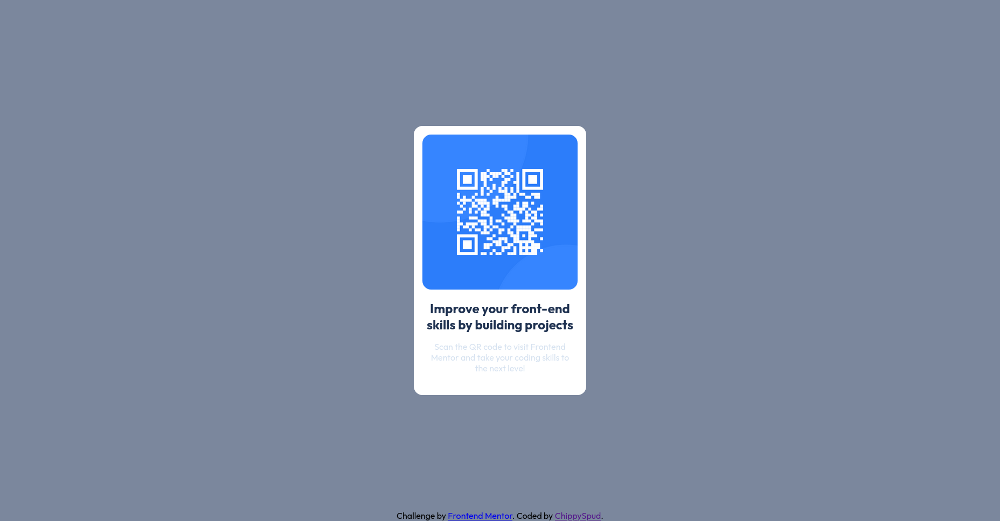

# Frontend Mentor - QR code component solution

This is a solution to the [QR code component challenge on Frontend Mentor](https://www.frontendmentor.io/challenges/qr-code-component-iux_sIO_H). Frontend Mentor challenges help you improve your coding skills by building realistic projects.

## Table of contents

- [Overview](#overview)
    - [Screenshot](#screenshot)
    - [Links](#links)
- [Author](#author)

## Overview

### Screenshot

### Links

- Solution URL: [QR Code Component Solution](https://github.com/CFeeney333/QRCodeComponent)
- Live Site URL: [QR Code Component Live Preview](https://your-live-site-url.com)

## Author

- Frontend Mentor - [@CFeeney333](https://www.frontendmentor.io/profile/CFeeney333)
